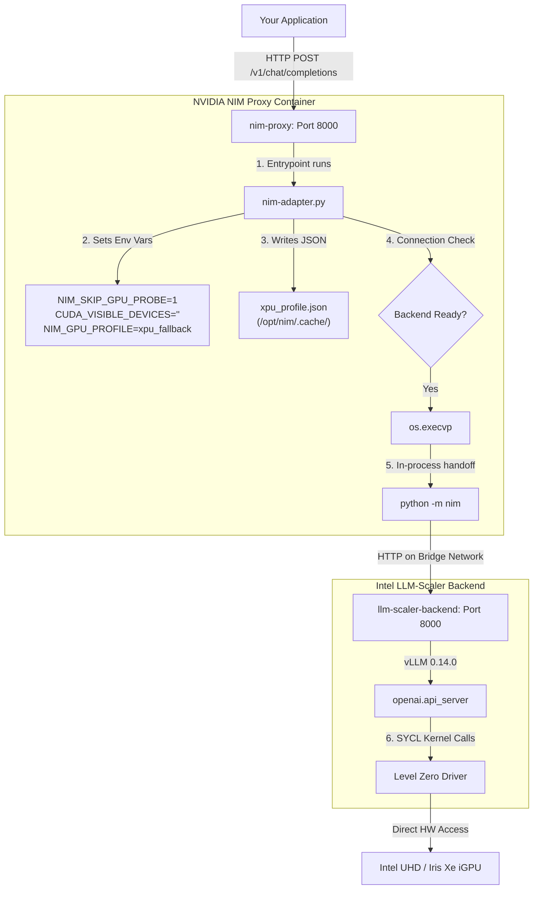

# NIM + Intel LLM-Scaler on Intel iGPU: Comprehensive Implementation & Operational Guide

> **Scope:** This guide provides a master reference for deploying NVIDIA NIM with the **Intel LLM-Scaler** (vLLM-based) backend on Intel iGPUs (such as UHD and Iris Xe Graphics). It covers the complete architecture, details all implementation files, identifies critical discrepancies between the documentation and the actual workspace files ("Gap Analysis"), and outlines step-by-step instructions for deployment, migration, optimization, and troubleshooting.

---

## 1. Project Architecture Overview

The system runs as a **dual-container, decoupled stack** orchestrated via Docker Compose. Because NVIDIA NIM expects an NVIDIA GPU with CUDA by default, this project uses a clever **shim-and-proxy pattern** to run inference on Intel iGPUs using Intel's Level Zero driver and SYCL runtime.



### Key Architectural Layers

1. **Client Application:** Any application making OpenAI-compatible API calls (e.g., standard Python SDK, LangChain, or curl).
2. **NIM Proxy Container (`nim-proxy`):** Runs the standard NVIDIA NIM container. By running the pre-entrypoint script `nim-adapter.py`, we bypass the Nvidia hardware requirement, skip the standard GPU checks, and point the NIM container to forward all token generation requests to the backend.
3. **Intel LLM-Scaler Backend (`llm-scaler-backend`):** Runs Intel's official `intel/llm-scaler-vllm:1.3` image. This contains a custom, highly optimized build of **vLLM 0.14.0** with native support for Intel XPU architectures via the **Intel Level Zero driver** and **SYCL runtime**. It serves as the raw inference engine, running the model in 4-bit quantization (`sym_int4`).
4. **Docker Bridge Network:** A dedicated network (`nim-llm-scaler-net`) facilitating high-speed HTTP communication between the proxy and backend containers.

---

## 2. IPEX-LLM vs. Intel LLM-Scaler

Intel restructured its workstation and AI PC inference strategy around **Project Battlematrix**. **LLM-Scaler** is the official public product name for this ecosystem, while **IPEX-LLM** serves as the underlying low-level library. Swapping the backend from IPEX-LLM to LLM-Scaler upgrades your backend to a modern, actively supported stack.

| Feature / Aspect | IPEX-LLM Backend (Fallback) | Intel LLM-Scaler Backend (Preferred) | Impact & Notes |
| :--- | :--- | :--- | :--- |
| **Docker Image** | `intelanalytics/ipex-llm-serving-xpu:latest` | `intel/llm-scaler-vllm:1.3` | Scaler is the official Project Battlematrix image |
| **vLLM Version** | `0.6.0` (Late 2025) | `0.14.0` (May 2026) | **8+ months of upstream optimizations**, better stability |
| **Release Cadence** | Quarterly | **Monthly minor releases** | Quick bug fixes and model support |
| **Speculative Decoding** | Unsupported | **Supported (Medusa, Suffix)** | **15% to 30% throughput increase** on Intel iGPUs |
| **Quantization Precision** | `sym_int4` (4-bit) | `sym_int4` (4-bit) / `sym_int6` (6-bit) | FP6 offers experimental, slightly higher-quality option |
| **Model Architectures** | Standard LLMs (Mistral, LLaMA) | Advanced LLMs & **MoE** (Qwen3-235B-A22B) | Broader architectural compatibility |
| **Intel Support Window** | Standard community support | **3-Year Enterprise Support** (to 2028) | Guaranteed updates for future hardware |

---

## 3. Detailed File Directory & Analysis

Here is a breakdown of the roles and mechanics of the key files in this deployment.

```
~/nim-ipex-deployment/
├── deploy.sh                          # CLI wrapper script to control the stack
├── docker-compose-llm-scaler.yml      # Service composition for LLM-Scaler
├── docker-compose.yml                 # Original compose file (kept as IPEX-LLM backup)
└── config/
    └── nim-adapter.py                 # GPU probe bypass script (mounted into nim-proxy)
```

### A. `config/nim-adapter.py`
This script executes inside `nim-proxy` before the NIM server starts:
* **Environment Patching:** Modifies environment variables to trick `nimlib`. It sets `NIM_SKIP_GPU_PROBE=1` to disable hardware diagnostics, `CUDA_VISIBLE_DEVICES=""` to hide Nvidia GPUs, and `NIM_GPU_PROFILE=xpu_fallback` to associate with a custom profile.
* **Mock Profile Creation:** Writes a JSON configuration to `/opt/nim/.cache/xpu_profile.json` detailing a mock hardware capabilities profiles. This satisfies the initialization checks of the NIM launcher.
* **TCP Pre-flight Connectivity Verification:** Attempts a TCP connection check against `NIM_BACKEND_URL` to ensure the inference engine is online and accepting requests before booting NIM.
* **Process Replacement:** Utilizes Python's `os.execvp("python", ["python", "-m", "nim"])` to replace its own process space with NIM. This guarantees that all environment changes made via `os.environ` in Python are natively inherited by NIM in-process.

### B. `docker-compose-llm-scaler.yml`
Declares the containerized services:
* **`llm-scaler-backend`:** 
  * Mounts `/dev/dri:/dev/dri` and binds the `render` group to grant the container direct user-space access to the iGPU.
  * Sets optimal Intel variables: `SYCL_CACHE_PERSISTENT=1` (persist compiled kernels to avoid subsequent boot delays) and `SYCL_DEVICE_FILTER=level_zero` (forces the high-performance driver).
  * Limits container memory usage to prevent system instability on machines with shared RAM (typical for iGPUs).
  * Exposes port `8001` externally for testing, and runs the standard vLLM OpenAI server wrapper inside.
* **`nim-proxy`:**
  * Binds public port `8000` to direct external clients.
  * Overrides the entrypoint to run `nim-adapter.py`.
  * Configures `depends_on` with `condition: service_healthy` targeting `llm-scaler-backend` so it only fires up once the vLLM server is fully active.

---

## 4. CRITICAL: Gap Analysis & Required Code Fixes

> [!WARNING]
> There are critical discrepancies between what the migration documentation describes as "fixed" and the actual files in your workspace. **The files in your workspace still contain the unfixed, broken code.** 
> Below is the analysis of these gaps and the exact code modifications you must make to run the stack successfully.

### Gap 1: `deploy.sh` Lacks LLM-Scaler Auto-Detection
* **The Problem:** The current `deploy.sh` file hardcodes the command `docker-compose` without a `-f` file flag, which means it will **only** look for `docker-compose.yml` (the older, fallback IPEX-LLM stack). Additionally, it streams logs only from `ipex-backend`, which does not exist in the new compose stack.
* **The Fix:** We must update `deploy.sh` to auto-detect if `docker-compose-llm-scaler.yml` is present, dynamically set the `-f` flag for all compose calls, and log from the correct backend service name.

Apply this change to [deploy.sh](file:///c:/Users/arnav.jade/Documents/NIM%20on%20Intel%20GPU/Fixes/deploy.sh):
```diff
# Replace lines 38 to 41 in deploy.sh with the following:
##############################################################################
# Configuration & Auto-Detection
##############################################################################

# Auto-detect active compose file and backend name
if [ -f "docker-compose-llm-scaler.yml" ]; then
    COMPOSE_FILE="docker-compose-llm-scaler.yml"
    BACKEND_SERVICE="llm-scaler-backend"
    BACKEND_NAME="Intel LLM-Scaler"
else
    COMPOSE_FILE="docker-compose.yml"
    BACKEND_SERVICE="ipex-backend"
    BACKEND_NAME="IPEX-LLM"
fi

# Helper function to call docker-compose with the right file
call_compose() {
    docker-compose -f "$COMPOSE_FILE" "$@"
}

load_config() {
```

Then, replace the service execution commands inside `deploy.sh` to use these variables:
```diff
# In cmd_start() (lines 112-120):
 cmd_start() {
-    log_info "Starting NIM + IPEX-LLM stack..."
+    log_info "Starting NIM + ${BACKEND_NAME} stack..."
     cmd_setup
-    docker-compose up -d
+    call_compose up -d
     log_info "Initial startup may take 2-5 min for SYCL kernel compilation."
-    log_info "Watch progress: docker-compose logs -f ipex-backend"
+    log_info "Watch progress: docker-compose -f ${COMPOSE_FILE} logs -f ${BACKEND_SERVICE}"
     echo ""
     log_success "Stack started"
 }

# In cmd_stop() (lines 122-126):
 cmd_stop() {
-    log_info "Stopping NIM + IPEX-LLM stack..."
-    docker-compose down
+    log_info "Stopping NIM + ${BACKEND_NAME} stack..."
+    call_compose down
     log_success "Stack stopped"
 }

# In cmd_logs() (lines 134-137):
 cmd_logs() {
     log_info "Showing logs (Ctrl+C to exit)..."
-    docker-compose logs -f ipex-backend nim-proxy
+    call_compose logs -f ${BACKEND_SERVICE} nim-proxy
 }

# In cmd_health() (line 160):
-    docker-compose ps --no-trunc || log_warn "Docker compose not initialized"
+    call_compose ps --no-trunc || log_warn "Docker compose not initialized"
```

---

### Gap 2: Broken Entrypoint Bash Wrapper in `docker-compose-llm-scaler.yml`
* **The Problem:** The `docker-compose-llm-scaler.yml` file in your workspace has an inherited broken wrapper:
  ```yaml
  entrypoint: ["/bin/bash", "-c"]
  command:
    - |
      python /opt/nim-adapter.py || true
      exec python -m nim
  ```
  This is highly problematic:
  1. `|| true` silently swallows Python script failures.
  2. Running `exec python -m nim` from bash causes NIM to spawn without inheriting any of the `os.environ` patches that were set in Python.
* **The Fix:** Change the entrypoint in `docker-compose-llm-scaler.yml` to launch `nim-adapter.py` directly using Python.

Apply this change to [docker-compose-llm-scaler.yml](file:///c:/Users/arnav.jade/Documents/NIM%20on%20Intel%20GPU/Fixes/docker-compose-llm-scaler.yml) (around line 105):
```diff
-    entrypoint: ["/bin/bash", "-c"]
-    command:
-      - |
-        python /opt/nim-adapter.py || true
-        exec python -m nim
+    entrypoint: ["python", "/opt/nim-adapter.py"]
```

---

### Gap 3: Insufficient `start_period` for Backend Healthcheck
* **The Problem:** In `docker-compose-llm-scaler.yml`, the backend healthcheck is configured with `start_period: 120s`. On Intel iGPUs, compiling SYCL kernels on the first run takes **2 to 5 minutes** (120s to 300s). At 120 seconds, Docker marks the backend container as unhealthy and restarts it. Since `nim-proxy` depends on the backend being healthy, the entire stack fails to launch on the first run.
* **The Fix:** Increase the `start_period` to `360s` (6 minutes) and increase retries to `5`.

Apply this change to [docker-compose-llm-scaler.yml](file:///c:/Users/arnav.jade/Documents/NIM%20on%20Intel%20GPU/Fixes/docker-compose-llm-scaler.yml) (around line 63):
```diff
     healthcheck:
       test: ["CMD", "curl", "-f", "http://localhost:8000/v1/models"]
       interval: 30s
       timeout: 10s
-      retries: 3
-      start_period: 120s
+      retries: 5
+      start_period: 360s
```

---

### Gap 4: `nim-adapter.py` Points to Wrong Fallback Service Name
* **The Problem:** In `nim-adapter.py`, the fallback backend URL defaults to `http://ipex-backend:8000` (line 32). In a pure LLM-Scaler environment or standalone tests without the full environment block, the hostname will not resolve.
* **The Fix:** Change the fallback URL to dynamically match the service name or default to the newer `llm-scaler-backend`.

Apply this change to [nim-adapter.py](file:///c:/Users/arnav.jade/Documents/NIM%20on%20Intel%20GPU/Fixes/nim-adapter.py) (line 32):
```diff
-        'NIM_BACKEND_URL': os.environ.get('NIM_BACKEND_URL', 'http://ipex-backend:8000'),
+        'NIM_BACKEND_URL': os.environ.get('NIM_BACKEND_URL', 'http://llm-scaler-backend:8000'),
```

---

## 5. Step-by-Step Deployment & Migration Playbook

### Step 1: Host Machine Prerequisites
Verify that your Intel host machine is ready:
1. **GPU Drivers:** Install Intel oneAPI Base Toolkit and ensure Level Zero drivers are functional. On Linux, the user running Docker must belong to the `render` and `video` groups:
   ```bash
   sudo usermod -aG render,video $USER
   newgrp render
   ```
2. **NGC API Key:** Ensure you have an active key from NVIDIA NGC to pull the NIM proxy image.
3. **Hardware Check:** Verify you have at least 16 GB of system RAM (32 GB is highly recommended as iGPU and OS share the same physical memory).

### Step 2: Configure the `.env` File
Create or verify your `.env` file in the project root:
```env
# ===== REQUIRED INPUTS =====
NIM_CONTAINER_URL=nvcr.io/nim/meta/llama-3.1-8b-instruct:latest
LLM_MODEL_NAME=meta-llama/Llama-2-7b-chat-hf
NGC_API_KEY=nvapi-your-ngc-api-key-here

# ===== OPTIONAL (defaults work out-of-the-box) =====
NIM_PROXY_PORT=8000
IPEX_BACKEND_PORT=8001
NIM_CACHE_PATH=~/.cache/nim
HF_CACHE_PATH=~/.cache/huggingface
```

---

### Option A: Fresh Deployment (First-time Setup)
If this is your first time setting up the stack, execute:
```bash
# 1. Initialize folders, cache pathways, and copy adapter script
./deploy.sh setup

# 2. Spin up the containers
./deploy.sh start

# 3. Stream backend startup logs (compilation takes 2-5 minutes)
./deploy.sh logs
```

---

### Option B: Migration from an Existing IPEX-LLM Stack
If you have an active IPEX-LLM deployment running from the original Quick Start Guide:

1. **Backup configurations:**
   ```bash
   cp docker-compose.yml docker-compose.yml.ipex-backup
   cp .env .env.backup
   ```
2. **Stop the active IPEX stack:**
   ```bash
   ./deploy.sh stop
   ```
3. **Apply the gap fixes** detailed in Section 4 of this guide to the following files:
   - `deploy.sh` (Auto-detection addition)
   - `docker-compose-llm-scaler.yml` (Entrypoint and healthcheck timing updates)
   - `config/nim-adapter.py` (Default host fallback update)
4. **Boot up the LLM-Scaler stack:**
   ```bash
   ./deploy.sh start
   ```
   *(On first run, Docker will pull `intel/llm-scaler-vllm:1.3` (~3.2 GB) and compile the SYCL kernels. Watch progress via `./deploy.sh logs`)*

---

### Step 3: Deployment Verification

#### 1. Confirm Health Status
Wait until the logs state that the vLLM engine and NIM adapter patches have completed. Then run:
```bash
./deploy.sh health
```
Expected output:
* IPEX Backend (port 8001): `[✓] responding`
* NIM Proxy (port 8000): `[✓] responding`

#### 2. Confirm vLLM Version Upgrade
Run this diagnostic command to verify you are on the 0.14.0+ codebase:
```bash
docker exec nim-llm-scaler-backend python3 -c "import vllm; print(vllm.__version__)"
# Expected output: 0.14.0 (or newer)
```

#### 3. Run Inference Smoke Test
Perform a local chat completion check:
```bash
./deploy.sh test
```
Expected output:
```json
"2+2 = 4"
```

---

## 6. Advanced Optimizations

These advanced tuning configurations are exclusively supported on the **Intel LLM-Scaler** platform.

### A. Speculative Decoding (15% to 30% Throughput Boost)
Speculative decoding uses the main LLM to run draft token evaluations in parallel using algorithms like Medusa. This dramatically improves generation speeds on compute-constrained iGPUs.

Edit [docker-compose-llm-scaler.yml](file:///c:/Users/arnav.jade/Documents/NIM%20on%20Intel%20GPU/Fixes/docker-compose-llm-scaler.yml) and modify the `command` block of the `llm-scaler-backend` service:

```yaml
    command: >
      python3 -m vllm.entrypoints.openai.api_server
        --model ${LLM_MODEL_NAME}
        --served-model-name ${LLM_MODEL_NAME}
        --device xpu
        --dtype float16
        --load-in-low-bit sym_int4
        --gpu-memory-utilization 0.85
        --max-model-len 4096
        --max-num-batched-tokens 10240
        --port 8000
        --trust-remote-code
        --enforce-eager
        --speculative-model ${LLM_MODEL_NAME}
        --num-speculative-tokens 5
        --speculative-algorithm medusa
```
Apply settings by restarting:
```bash
./deploy.sh restart
```
> [!NOTE]
> Speculative decoding requires additional graphics memory allocation. If you experience Out-Of-Memory (OOM) crashes, decrease `--num-speculative-tokens` to `3` or lower `--gpu-memory-utilization` to `0.75`.

### B. FP6 Quantization (Ultra-low Precision Option)
If you require more memory headroom than `FP16` but desire slightly higher generation quality than standard `INT4`:
Modify the `--load-in-low-bit` argument in `docker-compose-llm-scaler.yml`:
```yaml
        --load-in-low-bit sym_int6
```

---

## 7. Troubleshooting & Diagnostics Playbook

### Common Issues & Quick Resolutions

| Symptom / Error | Probable Cause | Actionable Resolution |
| :--- | :--- | :--- |
| **`llm-scaler-backend` shows `unhealthy` and exits** | `start_period` is set too low (original 120s) | Ensure you applied the **Gap 3 Fix** (change `start_period` to `360s` in the compose file). |
| **`nim-proxy` logs an error about unreachable backend** | The proxy launched before kernel compilation finished | This is normal on the first start. `nim-adapter.py` will automatically retry up to 5 times. If compilation is extremely slow, verify via `intel_gpu_top` that the GPU is working. |
| **SYCL compilation hangs indefinitely** | The persistent driver kernel cache is corrupted | Wipe the cache files: `rm -rf ~/.cache/sycl_cache*` and restart the stack. |
| **`401 Unauthorized` on startup** | Invalid NGC registry authentication | Run `docker login nvcr.io` manually with your `NGC_API_KEY` to verify access credentials. |
| **Inference speeds are extremely slow (<2 tokens/s)** | Quantization is not loading | Check the backend logs: `docker logs nim-llm-scaler-backend \| grep -i low_bit`. Ensure `--load-in-low-bit sym_int4` is explicitly passed in the command block. |

### Essential Diagnostic CLI Commands

* **Live GPU Telemetry (Core Frequency & RAM allocation):**
  ```bash
  docker exec -it nim-llm-scaler-backend intel_gpu_top
  ```
* **Verify Active Model Weight Quantization:**
  ```bash
  docker logs nim-llm-scaler-backend | grep -E "load_in_low_bit|quantiz"
  ```
* **Check Adapter Log Hook Output:**
  ```bash
  docker logs nim-proxy | grep "[NIM-ADAPTER]"
  ```
* **Get Docker Containers Port and Health State Table:**
  ```bash
  docker ps --format "table {{.Names}}\t{{.Status}}\t{{.Ports}}"
  ```

---

## 8. Rollback Action Plan

If you run into compatibility issues with the LLM-Scaler backend, you can roll back to the stable IPEX-LLM stack in under 30 seconds:

```bash
# 1. Stop the LLM-Scaler stack
./deploy.sh stop

# 2. Disable the LLM-Scaler compose template
mv docker-compose-llm-scaler.yml docker-compose-llm-scaler.yml.disabled

# 3. Start the stack (deploy.sh will automatically fall back to docker-compose.yml)
./deploy.sh start
```

To switch back to LLM-Scaler later:
```bash
mv docker-compose-llm-scaler.yml.disabled docker-compose-llm-scaler.yml
./deploy.sh restart
```
